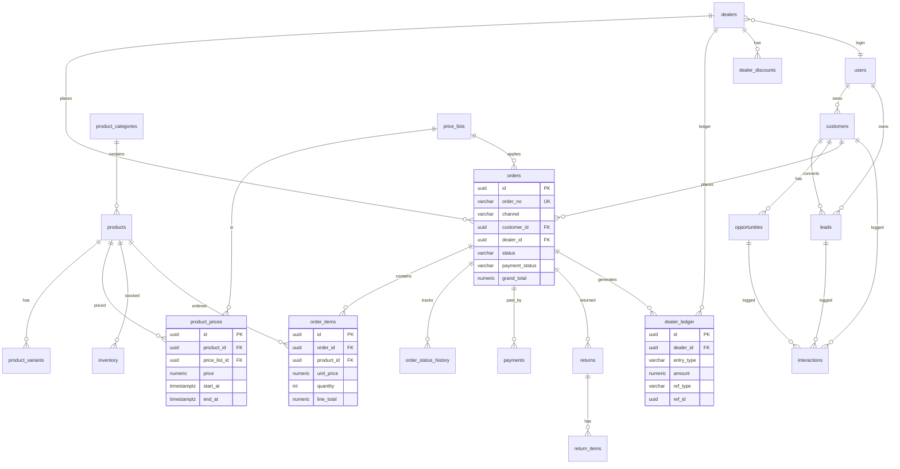
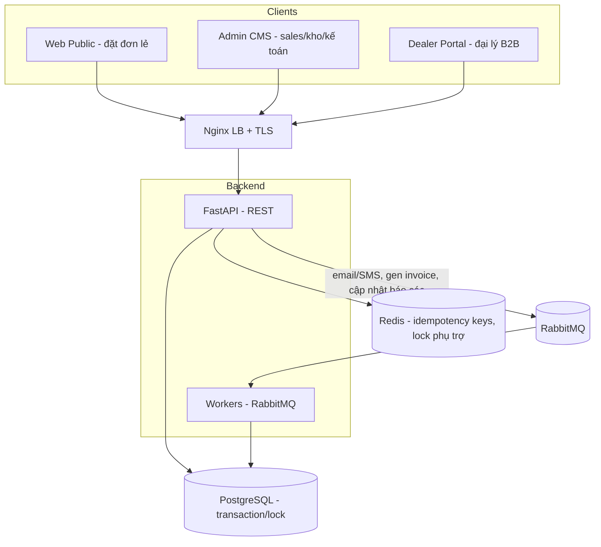

# Sâm Bà Đen Platform — Tài liệu Kiến trúc Enterprise
## Vòng 2: Module 4–7 (CRM · Quản lý Đại lý · Quản lý Sản phẩm · Quản lý Đơn hàng)

> Phiên bản 1.0 · Phạm vi: M4 CRM, M5 Dealer, M6 Product (đầy đủ), M7 Order
> Tiếp nối Vòng 1 (M1–M3). Stack giữ nguyên: React + Vite + TS + Tailwind · FastAPI + SQLAlchemy + Alembic · PostgreSQL · Redis · Elasticsearch · RabbitMQ · MinIO.
> Mục tiêu: lớp vận hành kinh doanh chuẩn enterprise — dữ liệu giao dịch nhất quán, công nợ chính xác, đa kênh (nội bộ + cổng đại lý).

---

## 0. Executive Summary

Vòng 2 biến nền tảng từ "mặt tiền thương hiệu" (Vòng 1) thành **hệ vận hành bán hàng**: theo dõi khách hàng & cơ hội (CRM), quản trị mạng lưới đại lý có chiết khấu & công nợ, danh mục sản phẩm đầy đủ với 2 bảng giá (lẻ/đại lý) và tồn kho, và vòng đời đơn hàng từ đặt → thanh toán → giao → hoàn.

Các quyết định nền tảng của vòng này:

1. **Đơn hàng là nguồn sự thật tài chính** — không sửa xóa cứng; mọi thay đổi đi qua trạng thái + bản ghi lịch sử (`order_status_history`) và bút toán công nợ (`dealer_ledger`).
2. **Tách "khách lẻ" (CRM customer) và "đại lý" (dealer/B2B)** — 2 loại khách có hành vi, bảng giá, công nợ và cổng đăng nhập khác nhau. Đơn hàng tham chiếu **một trong hai** qua `channel`.
3. **Số đơn & tồn kho phải nhất quán dưới tải cao** — dùng PostgreSQL transaction + row lock (`SELECT ... FOR UPDATE`) khi trừ tồn và sinh mã đơn; idempotency cho thao tác đặt hàng.
4. **Công nợ đại lý theo mô hình sổ cái (ledger)** — mỗi phát sinh (ghi nợ khi giao hàng, ghi có khi thanh toán) là 1 dòng bất biến; số dư = tổng hợp, không lưu số dư "trần" dễ sai.
5. **Pricing tách khỏi product** — bảng giá theo nhóm khách + lịch sử giá, cho phép chiết khấu đại lý theo bậc mà không phá giá lẻ.
6. **Cổng đại lý (Dealer Portal)** là frontend thứ 3 — tái dùng API admin nhưng RBAC giới hạn theo `dealer_id` (đại lý chỉ thấy dữ liệu của mình).

> **Ràng buộc tuân thủ tiếp nối Vòng 1:** thông tin sản phẩm vẫn phải tuân thủ quảng cáo TPCN; hóa đơn/đơn hàng cần trường phục vụ xuất hóa đơn điện tử (chuẩn bị tích hợp, không bịa nghĩa vụ thuế ở đây).

---

## 1. Business Analysis (BA)

### 1.1 Bài toán vận hành

| Vấn đề hiện trạng (giả định SME) | Hệ thống giải quyết |
| :--- | :--- |
| Lead từ form liên hệ/đăng ký đại lý (Vòng 1) bị rời rạc, không ai chăm | M4 CRM: gom lead, gán phụ trách, theo dõi pipeline |
| Đại lý quản lý bằng Excel: chiết khấu, công nợ, doanh số khó kiểm soát | M5: hồ sơ đại lý, bậc chiết khấu, sổ công nợ, dashboard riêng |
| Giá lẻ và giá đại lý lẫn lộn; đổi giá thủ công dễ sai | M6: 2 bảng giá + lịch sử giá + tồn kho |
| Đơn hàng ghi tay, không truy vết trạng thái, dễ lệch tồn/tiền | M7: vòng đời đơn hàng chuẩn + lịch sử + gắn công nợ |

### 1.2 Tác nhân (Actors) mới ở Vòng 2

| Actor | Loại | Mô tả | Kênh truy cập |
| :--- | :--- | :--- | :--- |
| Sales / CSKH | Nội bộ | Chăm lead, tạo cơ hội, tạo đơn hộ khách | Admin CMS |
| Sales Manager | Nội bộ | Phân bổ lead, duyệt chiết khấu, xem báo cáo | Admin CMS |
| Kế toán công nợ | Nội bộ | Ghi nhận thanh toán, đối soát công nợ đại lý | Admin CMS |
| Quản lý kho/sản phẩm | Nội bộ | Cập nhật giá, tồn kho, danh mục | Admin CMS |
| Đại lý (Dealer) | Đối tác B2B | Tự đặt hàng, xem công nợ, xem chiết khấu | **Dealer Portal** |
| Khách lẻ | B2C | Đặt hàng (đơn giản) qua website công khai | Web Public |

### 1.3 Phân khúc bán hàng & bảng giá

| Nhóm khách | Nguồn | Bảng giá áp dụng | Công nợ |
| :--- | :--- | :--- | :--- |
| Khách lẻ (PK1/PK2/PK3) | Website công khai | `retail` | Thanh toán ngay (không ghi nợ) |
| Đại lý cấp 1/2 | Cổng đại lý | `dealer_tier_1` / `dealer_tier_2` | Có hạn mức công nợ, kỳ thanh toán |

### 1.4 Success Metrics Vòng 2

| Nhóm | Chỉ số | Mục tiêu |
| :--- | :--- | :--- |
| CRM | Tỷ lệ lead được chăm trong 24h; tỷ lệ chuyển đổi lead → đơn | Theo dõi & tăng |
| Đại lý | Số dư công nợ quá hạn; doanh số/đại lý | Giảm quá hạn |
| Đơn hàng | Tỷ lệ đơn xử lý đúng SLA; tỷ lệ lệch tồn kho | < 1% lệch tồn |
| Tài chính | Đối soát công nợ khớp 100% | 100% |

---

## 2. Functional Requirements (FR)

### 2.1 Module 4 — CRM Khách hàng

| Mã | Chức năng | Mô tả |
| :--- | :--- | :--- |
| FR-CRM01 | Quản lý khách hàng | CRUD khách lẻ; gộp dữ liệu từ đơn hàng & liên hệ |
| FR-CRM02 | Quản lý Lead | Lead từ form (contact, đăng ký đại lý), nhập tay, import |
| FR-CRM03 | Pipeline cơ hội | Cơ hội bán hàng theo giai đoạn (new → qualified → proposal → won/lost) |
| FR-CRM04 | Gán phụ trách | Phân bổ lead/cơ hội cho sales; xoay vòng (round-robin) tùy chọn |
| FR-CRM05 | Lịch sử chăm sóc | Ghi nhật ký tương tác (gọi/ghi chú/email/SMS) theo timeline |
| FR-CRM06 | Email/SMS | Gửi email/SMS (qua queue + nhà cung cấp); lưu lịch sử |
| FR-CRM07 | Hành trình khách | Xem toàn bộ touchpoint: lead → cơ hội → đơn → chăm sóc |
| FR-CRM08 | Phân loại/tag | Tag, nguồn khách, trạng thái |

### 2.2 Module 5 — Quản lý Đại lý

| Mã | Chức năng | Mô tả |
| :--- | :--- | :--- |
| FR-DLR01 | Hồ sơ đại lý | CRUD đại lý: thông tin, khu vực, cấp bậc, người đại diện, tài khoản đăng nhập |
| FR-DLR02 | Khu vực | Phân vùng địa lý; ràng buộc/độc quyền khu vực (tùy chính sách) |
| FR-DLR03 | Chiết khấu | Bậc chiết khấu theo cấp đại lý + chiết khấu theo sản phẩm/đợt |
| FR-DLR04 | Công nợ | Sổ cái công nợ: ghi nợ khi giao, ghi có khi thanh toán; hạn mức & kỳ hạn |
| FR-DLR05 | Doanh số | Báo cáo doanh số theo đại lý/khu vực/kỳ |
| FR-DLR06 | Đơn của đại lý | Đại lý tạo & theo dõi đơn qua cổng riêng |
| FR-DLR07 | Dashboard đại lý | Cổng riêng: công nợ, đơn, chiết khấu hiện hành, lịch sử |
| FR-DLR08 | Duyệt đăng ký | Duyệt đại lý mới từ form đăng ký (Vòng 1) → kích hoạt tài khoản |

### 2.3 Module 6 — Quản lý Sản phẩm (đầy đủ, mở rộng từ Vòng 1)

| Mã | Chức năng | Mô tả |
| :--- | :--- | :--- |
| FR-PRD01 | Danh mục | Cây danh mục đa cấp |
| FR-PRD02 | Sản phẩm | Thuộc tính đầy đủ, SKU, mã vạch, đơn vị tính, biến thể (size/đóng gói) |
| FR-PRD03 | Giá bán lẻ | Bảng giá `retail` + lịch sử giá |
| FR-PRD04 | Giá đại lý | Bảng giá theo cấp đại lý + lịch sử |
| FR-PRD05 | Hình ảnh | Nhiều ảnh/biến thể (tái dùng `media_files`) |
| FR-PRD06 | Tồn kho | Tồn theo kho (liên kết M13 sau); cảnh báo tồn tối thiểu |
| FR-PRD07 | Trạng thái | active/hidden/discontinued |

### 2.4 Module 7 — Quản lý Đơn hàng

| Mã | Chức năng | Mô tả |
| :--- | :--- | :--- |
| FR-ORD01 | Đặt hàng | Tạo đơn (khách lẻ qua web, đại lý qua cổng, nội bộ tạo hộ) |
| FR-ORD02 | Dòng đơn | Nhiều dòng sản phẩm; tính giá theo bảng giá đúng kênh + chiết khấu |
| FR-ORD03 | Thanh toán | Ghi nhận thanh toán (COD/chuyển khoản/cổng); trạng thái thanh toán |
| FR-ORD04 | Vận chuyển | Thông tin giao hàng, đơn vị vận chuyển, mã vận đơn, trạng thái giao |
| FR-ORD05 | Trạng thái đơn | pending → confirmed → processing → shipped → delivered → completed; hủy/hoàn |
| FR-ORD06 | Hoàn đơn/đổi trả | Quy trình hoàn (return) + hoàn tiền/ghi có công nợ |
| FR-ORD07 | Lịch sử trạng thái | Mọi chuyển trạng thái được ghi lại (ai, khi nào, lý do) |
| FR-ORD08 | Gắn công nợ đại lý | Đơn đại lý ghi nợ vào `dealer_ledger` khi giao |
| FR-ORD09 | Trừ tồn kho | Trừ tồn an toàn (transaction + lock) khi xác nhận đơn |
| FR-ORD10 | Hóa đơn | Chuẩn bị dữ liệu xuất hóa đơn (tích hợp HĐĐT sau) |

---

## 3. Non-Functional Requirements (NFR Vòng 2)

| Mã | Thuộc tính | Yêu cầu |
| :--- | :--- | :--- |
| NFR-V2-01 | Nhất quán giao dịch | Mọi thao tác ảnh hưởng tiền/tồn chạy trong DB transaction; ACID; không partial update |
| NFR-V2-02 | Đồng thời | Trừ tồn & sinh mã đơn dùng row lock/sequence; chịu được nhiều đơn đồng thời không lệch |
| NFR-V2-03 | Idempotency | Endpoint đặt hàng & ghi thanh toán nhận `Idempotency-Key`, chống double-submit |
| NFR-V2-04 | Chính xác tài chính | Tiền dùng `numeric(14,2)`; không dùng float; làm tròn rõ ràng |
| NFR-V2-05 | Bất biến lịch sử | `order_status_history`, `dealer_ledger`, `payment` append-only |
| NFR-V2-06 | Cách ly đa kênh | Đại lý chỉ truy cập dữ liệu của chính mình (row-level qua `dealer_id`) |
| NFR-V2-07 | Audit | Mọi thao tác ghi nợ/giảm giá/đổi trạng thái → `audit_logs` (Vòng 1) |
| NFR-V2-08 | Báo cáo | Truy vấn doanh số/công nợ tối ưu bằng index + (tùy chọn) bảng tổng hợp |

---

## 4. Database Design (mở rộng)

> Tiếp nối schema Vòng 1. Tiền tệ: `numeric(14,2)`. UUID PK. Append-only cho bảng lịch sử/sổ cái.

### 4.1 Nhóm CRM (M4)

**customers** (khách lẻ — nâng cấp từ bảng tối giản Vòng 1)
| Cột | Kiểu | Ràng buộc | Ghi chú |
| :--- | :--- | :--- | :--- |
| id | UUID | PK | |
| full_name | varchar(255) | NOT NULL | |
| phone | varchar(20) | INDEX | định danh chính ở VN |
| email | varchar(255) | NULL | |
| address | text | NULL | |
| source | varchar(50) | NULL | web/contact/import/manual |
| owner_id | UUID | FK users, NULL | sales phụ trách |
| tags | varchar[] | NULL | |
| note | text | NULL | |
| created_at/updated_at/deleted_at | timestamptz | | |

**leads**
| Cột | Kiểu | Ràng buộc | Ghi chú |
| :--- | :--- | :--- | :--- |
| id | UUID | PK | |
| full_name | varchar(255) | NOT NULL | |
| phone | varchar(20) | INDEX | |
| email | varchar(255) | NULL | |
| source | varchar(50) | NOT NULL | contact_form/dealer_register/manual |
| source_ref_id | UUID | NULL | trỏ về contact_messages / dealer đăng ký |
| status | varchar(20) | NOT NULL | new/contacted/qualified/converted/lost |
| owner_id | UUID | FK users, NULL | |
| customer_id | UUID | FK customers, NULL | khi convert |
| created_at/updated_at | timestamptz | | |

**opportunities** → id, customer_id(FK), title, stage(new/qualified/proposal/won/lost), est_value numeric(14,2), owner_id(FK), expected_close_date, created_at.

**interactions** (nhật ký chăm sóc, append-only) → id, entity_type(lead/customer/opportunity), entity_id, type(call/note/email/sms), content, channel, created_by(FK users), created_at.

### 4.2 Nhóm Đại lý (M5)

**dealers** (nâng cấp từ Vòng 1)
| Cột | Kiểu | Ràng buộc | Ghi chú |
| :--- | :--- | :--- | :--- |
| id | UUID | PK | |
| code | varchar(30) | UNIQUE | mã đại lý |
| name | varchar(255) | NOT NULL | |
| tier | varchar(20) | NOT NULL | tier_1/tier_2 |
| region | varchar(100) | INDEX | khu vực |
| address | text | NULL | |
| contact_name | varchar(255) | NULL | |
| phone | varchar(20) | NULL | |
| lat / lng | numeric(9,6) | NULL | bản đồ |
| credit_limit | numeric(14,2) | DEFAULT 0 | hạn mức công nợ |
| payment_term_days | int | DEFAULT 0 | kỳ thanh toán |
| user_id | UUID | FK users, NULL | tài khoản đăng nhập cổng |
| status | varchar(20) | DEFAULT 'pending' | pending/active/suspended |
| created_at/updated_at | timestamptz | | |

**dealer_discounts** → id, dealer_id(FK) NULL, tier(NULL), product_id(FK) NULL, category_id(FK) NULL, discount_percent numeric(5,2), start_at, end_at, is_active. (Linh hoạt: chiết khấu theo đại lý cụ thể, theo cấp, theo sản phẩm hoặc danh mục, có hiệu lực thời gian.)

**dealer_ledger** (sổ cái công nợ — APPEND ONLY)
| Cột | Kiểu | Ràng buộc | Ghi chú |
| :--- | :--- | :--- | :--- |
| id | UUID | PK | |
| dealer_id | UUID | FK dealers | INDEX |
| entry_type | varchar(10) | NOT NULL | debit (ghi nợ) / credit (ghi có) |
| amount | numeric(14,2) | NOT NULL, > 0 | |
| ref_type | varchar(20) | | order/payment/adjustment/return |
| ref_id | UUID | | trỏ đơn/thanh toán |
| note | text | NULL | |
| created_by | UUID | FK users | |
| created_at | timestamptz | NOT NULL | |

> Số dư công nợ = `SUM(debit) - SUM(credit)` theo `dealer_id`. Không lưu cột "balance" để tránh lệch; nếu cần hiệu năng → bảng tổng hợp cập nhật qua trigger/worker.

### 4.3 Nhóm Sản phẩm & Giá (M6)

**products** — bổ sung cột so với Vòng 1: `sku varchar(50) UNIQUE`, `barcode varchar(50)`, `unit varchar(20)`, `min_stock int DEFAULT 0`.

**product_variants** (tùy chọn) → id, product_id(FK), sku(UNIQUE), name(vd "Hộp 500g"), attributes(jsonb), is_active.

**price_lists** → id, code(UNIQUE: retail/dealer_tier_1/dealer_tier_2), name, currency DEFAULT 'VND', is_active.

**product_prices** (lịch sử giá)
| Cột | Kiểu | Ràng buộc | Ghi chú |
| :--- | :--- | :--- | :--- |
| id | UUID | PK | |
| product_id | UUID | FK | |
| variant_id | UUID | FK, NULL | |
| price_list_id | UUID | FK price_lists | |
| price | numeric(14,2) | NOT NULL | |
| start_at | timestamptz | NOT NULL | hiệu lực từ |
| end_at | timestamptz | NULL | NULL = hiện hành |

> Giá hiện hành = bản ghi có `end_at IS NULL` (hoặc start_at gần nhất ≤ now). Đổi giá = đóng bản cũ (`end_at=now`) + tạo bản mới → giữ lịch sử.

**inventory** → id, product_id(FK), variant_id(FK NULL), warehouse_id(FK NULL, mở rộng M13), quantity int NOT NULL DEFAULT 0, reserved int DEFAULT 0. (Tồn khả dụng = quantity - reserved.)

### 4.4 Nhóm Đơn hàng (M7)

**orders**
| Cột | Kiểu | Ràng buộc | Ghi chú |
| :--- | :--- | :--- | :--- |
| id | UUID | PK | |
| order_no | varchar(20) | UNIQUE, NOT NULL | sinh theo sequence (vd SBD-2026-000123) |
| channel | varchar(10) | NOT NULL | retail / dealer / internal |
| customer_id | UUID | FK customers, NULL | nếu khách lẻ |
| dealer_id | UUID | FK dealers, NULL | nếu đại lý |
| price_list_id | UUID | FK price_lists | bảng giá áp dụng |
| status | varchar(20) | NOT NULL | pending/confirmed/processing/shipped/delivered/completed/cancelled/returned |
| payment_status | varchar(20) | NOT NULL | unpaid/partial/paid/refunded |
| subtotal | numeric(14,2) | NOT NULL | |
| discount_total | numeric(14,2) | DEFAULT 0 | |
| shipping_fee | numeric(14,2) | DEFAULT 0 | |
| grand_total | numeric(14,2) | NOT NULL | |
| shipping_address | text | NULL | |
| shipping_carrier | varchar(50) | NULL | |
| tracking_no | varchar(50) | NULL | |
| note | text | NULL | |
| created_by | UUID | FK users, NULL | nếu nội bộ tạo |
| created_at/updated_at | timestamptz | | |

**order_items** → id, order_id(FK), product_id(FK), variant_id(FK NULL), product_name(snapshot), unit_price(snapshot numeric(14,2)), discount_percent numeric(5,2), quantity int, line_total numeric(14,2). (Snapshot tên & giá tại thời điểm đặt — đơn không đổi khi giá/sp đổi sau.)

**order_status_history** (APPEND ONLY) → id, order_id(FK), from_status, to_status, reason, changed_by(FK users), created_at.

**payments** (APPEND ONLY) → id, order_id(FK), method(cod/bank/gateway), amount numeric(14,2), status(pending/success/failed/refunded), txn_ref, paid_at, created_by, created_at.

**returns** → id, order_id(FK), reason, status(requested/approved/rejected/refunded), refund_amount numeric(14,2), created_by, created_at. **return_items** → id, return_id(FK), order_item_id(FK), quantity.

### 4.5 Index & toàn vẹn

| Bảng | Index / Ràng buộc | Lý do |
| :--- | :--- | :--- |
| orders | `order_no`(unique), `(channel,status)`, `dealer_id`, `customer_id`, `created_at` · **PARTITION BY RANGE(created_at)** theo tháng/quý | Bảng lớn, báo cáo theo kỳ |
| order_items | `order_id`, `product_id` | Join nhanh |
| dealer_ledger | `(dealer_id, created_at)` | Tính số dư |
| product_prices | `(product_id, price_list_id, end_at)` | Lấy giá hiện hành |
| inventory | UNIQUE `(product_id, variant_id, warehouse_id)`; CHECK `quantity >= 0` | Chống âm tồn |
| payments | `order_id`, `status` | Đối soát |


---

## 5. ERD (Vòng 2)



---

## 6. API Design (Vòng 2)

> Tiếp nối `/api/v1`. Ba nhóm: Admin (nội bộ), Dealer Portal (đại lý — lọc theo `dealer_id`), Public (đặt hàng lẻ).

### 6.1 CRM (Admin)

| Method | Endpoint | Quyền |
| :--- | :--- | :--- |
| GET/POST/PUT | `/admin/customers` | `customer.read/write` |
| GET/POST/PUT | `/admin/leads` | `lead.read/write` |
| POST | `/admin/leads/{id}/convert` | `lead.convert` (lead → customer + opportunity) |
| PATCH | `/admin/leads/{id}/assign` | `lead.assign` |
| GET/POST/PUT | `/admin/opportunities` | `opportunity.*` |
| POST | `/admin/interactions` | ghi nhật ký chăm sóc |
| GET | `/admin/customers/{id}/journey` | xem hành trình khách hàng |

### 6.2 Đại lý (Admin + Dealer Portal)

| Method | Endpoint | Ngữ cảnh |
| :--- | :--- | :--- |
| GET/POST/PUT | `/admin/dealers` | Admin quản trị đại lý |
| PATCH | `/admin/dealers/{id}/approve` | Duyệt đại lý mới |
| GET/POST | `/admin/dealers/{id}/discounts` | Cấu hình chiết khấu |
| GET | `/admin/dealers/{id}/ledger` | Sổ công nợ (admin) |
| POST | `/admin/dealers/{id}/ledger/payment` | Kế toán ghi nhận thanh toán (credit) |
| GET | `/dealer/me` | Dealer: hồ sơ của mình |
| GET | `/dealer/me/ledger` | Dealer: công nợ của mình |
| GET | `/dealer/me/discounts` | Dealer: chiết khấu hiện hành |
| GET | `/dealer/me/orders` | Dealer: đơn của mình |
| POST | `/dealer/me/orders` | Dealer: tạo đơn |

### 6.3 Sản phẩm & Giá (Admin)

| Method | Endpoint |
| :--- | :--- |
| GET/POST/PUT | `/admin/products` (mở rộng: sku, unit, variants) |
| GET/POST | `/admin/products/{id}/variants` |
| GET/POST | `/admin/products/{id}/prices` (đóng giá cũ + tạo giá mới) |
| GET | `/admin/price-lists` |
| GET/PATCH | `/admin/inventory` (điều chỉnh tồn — ghi audit) |

### 6.4 Đơn hàng

| Method | Endpoint | Ngữ cảnh |
| :--- | :--- | :--- |
| POST | `/public/orders` | Khách lẻ đặt (giá retail) — `Idempotency-Key` |
| POST | `/dealer/me/orders` | Đại lý đặt (giá theo tier) — `Idempotency-Key` |
| POST | `/admin/orders` | Nội bộ tạo hộ |
| GET | `/admin/orders` | Lọc channel/status/date; phân trang |
| GET | `/admin/orders/{id}` | Chi tiết + items + history + payments |
| PATCH | `/admin/orders/{id}/status` | Chuyển trạng thái (ghi history; trừ tồn khi confirm; ghi nợ khi shipped với đại lý) |
| POST | `/admin/orders/{id}/payments` | Ghi nhận thanh toán |
| POST | `/admin/orders/{id}/returns` | Tạo yêu cầu hoàn |

### 6.5 Hợp đồng tạo đơn (ví dụ)

```jsonc
// POST /dealer/me/orders   (Header: Idempotency-Key: <uuid>)
{
  "items": [
    { "product_id": "uuid", "variant_id": "uuid|null", "quantity": 10 }
  ],
  "shipping_address": "...",
  "note": "Giao trước thứ 6"
}
// Server tự: xác định price_list theo tier đại lý → lấy giá hiện hành →
// áp chiết khấu (dealer_discounts) → tính line_total/subtotal/grand_total →
// kiểm tồn khả dụng → tạo order(status=pending). KHÔNG trừ tồn cho tới khi confirm.
// Response:
{ "data": { "order_no": "SBD-2026-000123", "grand_total": 1530000,
            "status": "pending", "payment_status": "unpaid" } }
```

---

## 7. System Architecture (bổ sung Vòng 2)

### 7.1 Bổ sung thành phần



### 7.2 Luồng nghiệp vụ then chốt

**Tạo & xác nhận đơn (chống lệch tồn):**
```
1. POST order: tính giá (server-side), tạo order(pending) — chưa trừ tồn.
2. PATCH status=confirmed:
   BEGIN TRANSACTION
     SELECT ... FROM inventory WHERE product_id=? FOR UPDATE   -- khóa dòng tồn
     IF available < qty -> ROLLBACK, trả lỗi 409 hết hàng
     UPDATE inventory SET reserved = reserved + qty            -- giữ chỗ
     INSERT order_status_history(pending->confirmed)
   COMMIT
3. PATCH status=shipped:
   - trừ thực tồn (quantity -= qty, reserved -= qty)
   - nếu channel=dealer: INSERT dealer_ledger(debit, ref=order)  -- ghi nợ
4. PATCH status=completed + payment success.
```

**Idempotency:** key lưu Redis (TTL 24h) → cùng key trả về cùng kết quả, chống tạo trùng đơn khi mạng chập.

**Công nợ đại lý:** ghi nợ khi giao (debit), kế toán ghi có khi nhận tiền (credit). Số dư = tổng hợp ledger. Cảnh báo khi vượt `credit_limit` (chặn tạo đơn mới tùy chính sách).

---

## 8. UI/UX Design (Vòng 2)

### 8.1 Admin CMS — màn hình mới

| Màn hình | Thành phần chính |
| :--- | :--- |
| CRM Pipeline | Kanban cơ hội (kéo-thả giai đoạn) + bộ lọc + panel chi tiết khách |
| Lead Inbox | Bảng lead + nút "Chăm sóc" (ghi interaction) + gán phụ trách |
| Customer 360 | Timeline hành trình: lead → cơ hội → đơn → tương tác |
| Dealer Manager | Bảng đại lý + tab: hồ sơ / chiết khấu / công nợ / đơn |
| Ledger | Bảng sổ cái + số dư + nút "Ghi nhận thanh toán" |
| Product + Pricing | Form sản phẩm + tab giá (retail/tier) với lịch sử |
| Order Board | Bảng đơn theo trạng thái + chi tiết đơn + đổi trạng thái có lý do |

### 8.2 Dealer Portal — gọn, tập trung tác vụ

| Màn hình | Nội dung |
| :--- | :--- |
| Dashboard | Công nợ hiện tại, hạn mức, đơn gần đây, chiết khấu đang áp |
| Đặt hàng | Chọn sản phẩm (giá đã theo tier) → giỏ → xác nhận |
| Đơn của tôi | Danh sách + trạng thái + mã vận đơn |
| Công nợ | Sổ cái của riêng đại lý + lịch sử thanh toán |

### 8.3 Nguyên tắc
- Dealer Portal dùng lại design system Vòng 1 (xanh dược liệu/vàng đất) nhưng layout tác vụ-trước (task-first), tối giản.
- Mọi số tiền hiển thị định dạng VND, có dấu phân cách; trạng thái có badge màu.
- Thao tác đổi trạng thái đơn & ghi công nợ luôn yêu cầu xác nhận + lý do (audit).


---

## 9. Folder Structure (bổ sung)

### 9.1 Backend — module mới

```
backend/app/
├── models/        + customer.py, lead.py, opportunity.py, interaction.py,
│                    dealer.py, dealer_ledger.py, dealer_discount.py,
│                    price_list.py, product_price.py, product_variant.py,
│                    inventory.py, order.py, order_item.py, payment.py, return.py
├── schemas/       + tương ứng DTO (OrderCreateDTO, OrderDetailDTO, LedgerEntryDTO...)
├── services/      + crm_service.py, dealer_service.py, ledger_service.py,
│                    pricing_service.py, inventory_service.py, order_service.py
├── repositories/  + order_repository.py, ledger_repository.py, ...
├── api/v1/
│   ├── admin/     + customers.py, leads.py, opportunities.py, dealers.py,
│   │                products.py(mở rộng), prices.py, inventory.py, orders.py
│   ├── dealer/    + me.py (portal: profile, ledger, discounts, orders)
│   └── public/    + orders.py (đặt đơn lẻ)
└── core/
    └── locking.py + helper transaction + SELECT FOR UPDATE, idempotency (Redis)
```

### 9.2 Frontend — app thứ 3

```
dealer-portal/          # React + Vite + TS (SPA, RBAC theo dealer_id)
├── src/
│   ├── pages/          # Dashboard, PlaceOrder, MyOrders, Ledger
│   ├── features/order/ # giỏ hàng, tính giá hiển thị
│   ├── lib/ (api, auth)
│   └── store/ (cart, auth - Zustand)
└── Dockerfile

admin-cms/src/pages/    + Crm/, Leads/, Dealers/, Ledger/, Pricing/, Orders/
```

---

## 10. Source Code — chuẩn & mẫu then chốt

### 10.1 Pricing Service (chọn đúng giá theo kênh + chiết khấu)

```python
class PricingService:
    async def resolve_unit_price(self, product_id, variant_id, price_list_id) -> Decimal:
        # giá hiện hành: end_at IS NULL, đúng price_list
        price = await self.repo.current_price(product_id, variant_id, price_list_id)
        if price is None:
            raise NotFoundError("price_not_set", "Sản phẩm chưa cấu hình giá cho bảng giá này")
        return price

    async def apply_dealer_discount(self, base, dealer, product_id, category_id) -> Decimal:
        pct = await self.repo.best_discount(dealer.id, dealer.tier, product_id, category_id)
        return (base * (Decimal(100) - pct) / Decimal(100)).quantize(Decimal("1.00"))
```

### 10.2 Order Service — xác nhận đơn an toàn (transaction + lock)

```python
class OrderService:
    async def confirm(self, order_id: UUID, actor: User):
        async with self.db.begin():                      # 1 transaction
            order = await self.repo.get_for_update(order_id)
            if order.status != "pending":
                raise ConflictError("invalid_state", "Đơn không ở trạng thái chờ xác nhận")
            for item in order.items:
                inv = await self.inv_repo.lock_row(item.product_id, item.variant_id)  # FOR UPDATE
                if inv.available < item.quantity:
                    raise ConflictError("out_of_stock", f"Hết hàng: {item.product_name}")
                inv.reserved += item.quantity
            await self.history.add(order, "pending", "confirmed", actor)
            order.status = "confirmed"
        # commit tự động khi thoát block
```

### 10.3 Ledger Service — ghi nợ/ghi có (append-only) + số dư

```python
class LedgerService:
    async def debit_on_ship(self, dealer_id, order):
        await self.repo.add_entry(dealer_id, "debit", order.grand_total,
                                  ref_type="order", ref_id=order.id)

    async def record_payment(self, dealer_id, amount, actor):
        await self.repo.add_entry(dealer_id, "credit", amount,
                                  ref_type="payment", created_by=actor.id)

    async def balance(self, dealer_id) -> Decimal:
        return await self.repo.sum_debit_minus_credit(dealer_id)
```

### 10.4 Quy ước
- Tiền: `Decimal`/`numeric(14,2)`, không float. Làm tròn `quantize`.
- Mọi ghi tài chính/tồn nằm trong `async with db.begin()`.
- Endpoint đặt hàng & ghi thanh toán bọc idempotency middleware (key Redis).
- Snapshot tên/giá vào `order_items` lúc tạo đơn.

---

## 11. Security Considerations (Vòng 2)

| Lĩnh vực | Biện pháp |
| :--- | :--- |
| Cách ly đa tenant đại lý | Dealer Portal: token chứa `dealer_id`; mọi truy vấn `/dealer/me/*` ép filter `dealer_id` từ token, không nhận từ client |
| Phân quyền tài chính | Ghi công nợ/thanh toán/giảm giá → permission riêng (`ledger.write`, `order.discount`); tách vai sales vs kế toán |
| Chống gian lận giá | Giá tính 100% phía server từ bảng giá; client không gửi giá |
| Idempotency | Chống tạo trùng đơn/thanh toán |
| Toàn vẹn | CHECK `quantity>=0`, `amount>0`; transaction; bảng lịch sử append-only |
| Audit | Mọi đổi trạng thái đơn, ghi nợ, đổi giá vào `audit_logs` với diff |
| Rate limit | Endpoint đặt đơn công khai siết theo IP/khách |
| Dữ liệu cá nhân | SĐT/email khách trong CRM: hạn chế truy cập theo role; log truy cập nhạy cảm |

---

## 12. SEO Recommendations

Vòng 2 chủ yếu là hệ nội bộ/B2B nên SEO không phải trọng tâm. Lưu ý:
- Trang sản phẩm công khai (M1/M6) giữ chuẩn SEO Vòng 1; chỉ giá lẻ hiển thị công khai, **giá đại lý không lộ public**.
- Dealer Portal & Admin: `noindex` toàn bộ, chặn qua robots + auth.

---

## 13. Deployment Guide (bổ sung)

### 13.1 Biến môi trường thêm

```env
SMS_PROVIDER_KEY=...            # gửi SMS CRM
EMAIL_PROVIDER_KEY=...
ORDER_NO_PREFIX=SBD            # tiền tố mã đơn
DEALER_PORTAL_URL=https://dealer.sambaden.vn
IDEMPOTENCY_TTL=86400
```

### 13.2 Migration & dữ liệu nền

```
alembic revision -m "v2 crm dealer product order"
# seed: price_lists (retail, dealer_tier_1, dealer_tier_2)
# sequence: order_no (SBD-YYYY-NNNNNN)
```

### 13.3 Dịch vụ bổ sung
- Thêm container `dealer-portal`; Nginx route `dealer.sambaden.vn`.
- Worker thêm hàng đợi: `crm_notify` (email/SMS), `order_events` (gen invoice data, cập nhật báo cáo).

### 13.4 Vận hành tài chính
- Job đối soát công nợ định kỳ (so tổng ledger vs đơn đã giao).
- Cảnh báo đại lý vượt hạn mức / quá hạn thanh toán (worker + notification).
- Backup giữ nguyên Vòng 1; nhấn mạnh PITR cho dữ liệu giao dịch.

---

## 14. Future Enhancements

| Hạng mục | Liên kết |
| :--- | :--- |
| Gắn đơn → lô trồng để truy xuất QR | M8–M11 |
| Tồn kho theo nhiều kho (warehouse_id đã chừa) | M13 |
| Tích hợp hóa đơn điện tử (HĐĐT) + nghĩa vụ thuế | tích hợp ngoài |
| Cổng thanh toán online (VNPay/Momo) cho khách lẻ | M7+ |
| Bảng tổng hợp doanh số/công nợ (materialized view) cho dashboard BGĐ | M16 |
| AI gợi ý chăm sóc lead / dự báo công nợ quá hạn | M15 |

---

## 15. ADR — Vòng 2

| # | Quyết định | Bối cảnh | Lựa chọn | Đánh đổi |
| :--- | :--- | :--- | :--- | :--- |
| ADR-V2-01 | Công nợ theo sổ cái (ledger) | Cần chính xác, truy vết | Append-only entries, số dư = tổng hợp | Truy vấn số dư nặng hơn; bù bằng bảng tổng hợp nếu cần |
| ADR-V2-02 | Tách customer (B2C) và dealer (B2B) | Hành vi/giá/công nợ khác | 2 thực thể, order tham chiếu qua channel | Logic đặt đơn rẽ nhánh; rõ ràng hơn |
| ADR-V2-03 | Giá tách bảng + lịch sử | Đổi giá thường xuyên, cần lịch sử & 2 kênh | price_lists + product_prices | Thêm join; linh hoạt & audit tốt |
| ADR-V2-04 | Trừ tồn bằng transaction + FOR UPDATE | Chống lệch tồn khi đồng thời | Pessimistic lock | Giảm song song cục bộ; đúng đắn ưu tiên |
| ADR-V2-05 | Snapshot giá/tên vào order_items | Đơn không được đổi khi giá đổi sau | Lưu bản sao | Trùng lặp dữ liệu; bất biến đơn hàng |
| ADR-V2-06 | Idempotency key (Redis) | Chống double-submit đơn/thanh toán | Key TTL 24h | Thêm hạ tầng nhẹ; an toàn giao dịch |
| ADR-V2-07 | Dealer Portal là app riêng | Cách ly B2B, RBAC theo dealer_id | Frontend thứ 3 | Thêm build; bảo mật & UX tốt hơn |

---

*Hết tài liệu Vòng 2 (M4–M7). Đã khớp schema với Vòng 1. Vòng tiếp theo có thể là: code production cho một lát cắt (vd luồng đặt đơn end-to-end), hoặc kiến trúc ERP nông nghiệp M8–M11 (lô trồng → nhật ký → thu hoạch → QR truy xuất).*
